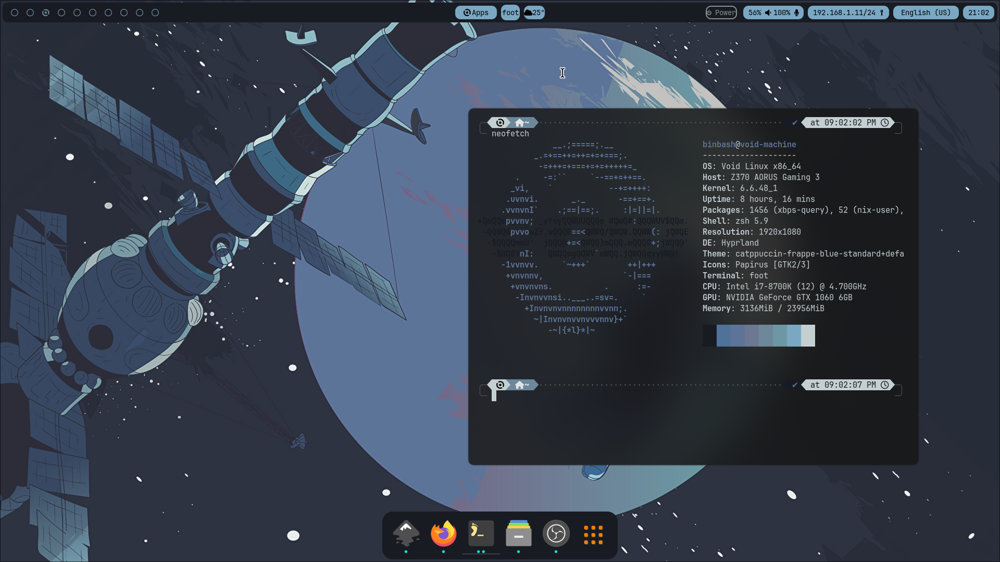

#дисклэймер предполагаю врянт что у вас должны быть установлены и активный сервисы
_______________________________________________________________________________________
**polkit elogind seatd** без даных зависимостей **Hyprland** просто не запустится всякие шрифты на ваш вкус и т.д
также

```
sudo usermod -aG video $USER
sudo usermod -aG _seatd $USER
```

## Из настоятельных рекомендации
_______________________________________________________________________________________
использовал как Launcher rofi-wayland его можно скомпилировать из 
изходников обычный rofi под иксы работает так себе также опцианально но лучше всего будет заранее обновится

```
sudo xbps-install -Su
```

**По hyprland**

```
$ sudo touch /etc/xbps.d/hyprland-void.conf
$ sudo echo "repository=https://raw.githubusercontent.com/Makrennel/hyprland-void/repository-x86_64-glibc" >> /etc/xbps.d/hyprland-void.conf
```
дальше "sudo xbps-install -S hyprland hyprland-protocols xdg-desktop-portal-hyprland"


## Также прикладной софт(а даже базовый софт)
_______________________________________________________________________________________

```
sudo xbps-install -S Waybar git swww foot zsh pywal
```
