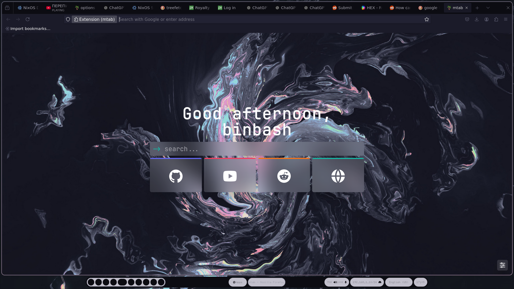
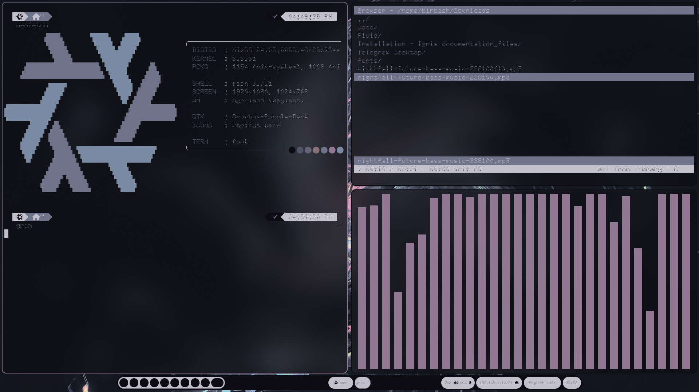

# дисклэймер 
_______________________________________________________________________________________
установка велась на Nixos но установив все нужные основные пакеты как 

1) wofi
2) waybar
3) foot
4) Hyprland

## Hyprland
 он ставиться
 строками в /etc/nixos/configuration.nix как
 ```
   programs.hyprland = {
  	xwayland.enable = true;
  	enable = true;
  };
```




